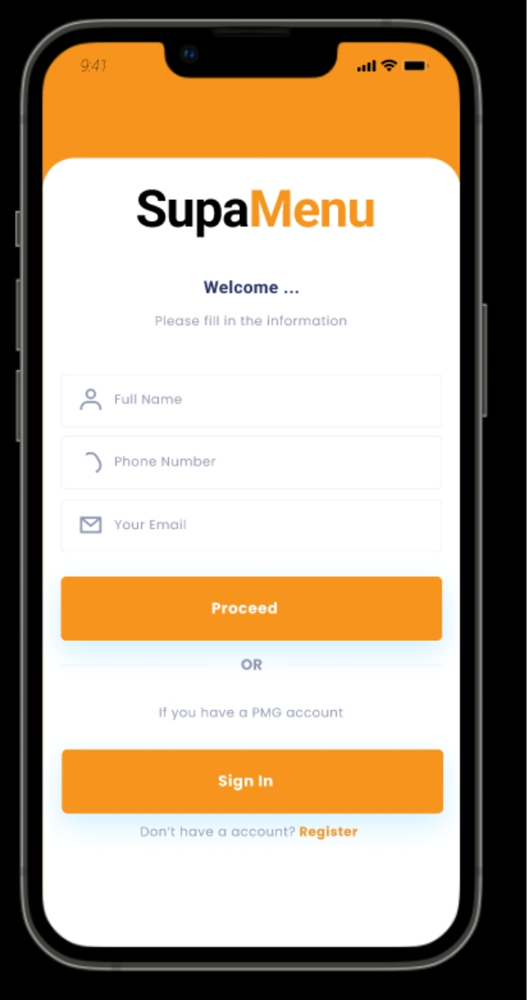
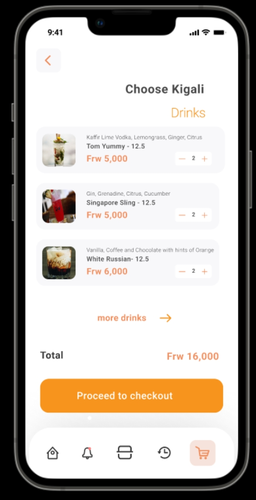

# Supermenu Mobile Application
This Food ordering application is a mobile application that allows customers to order food from a restaurant. The application is built using React Native and Express. The application allows customers to view the menu, add items to the cart, and place an order. The application also allows customers to view their order history and reorder items from their order history. The application also allows customers to view their profile and update their profile information.

## Screenshots

